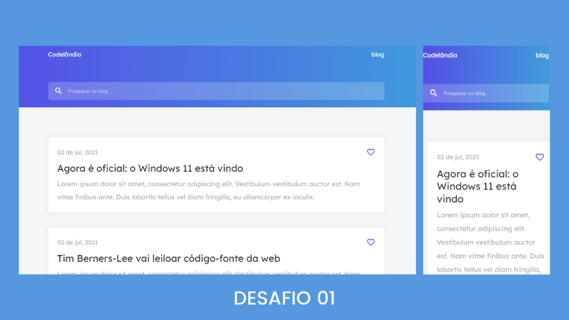

## 🌈 sobre

este foi um projeto desenvolvido a partir de um protótipo do figma, disponibilizado pelo [IuriCode](https://github.com/iuricode/), criador da comunidade [Codelândia](https://discord.com/invite/QevDJqCzaY). a ideia é recriar a tela o mais próximo do modelo, possibilitando o usuário visualizar o layout idenpendente do tamanho da tela.
para a criação, utilizei flexbox e a biblioteca scroll reveal. 

## ✨ tecnologias

esses projetos foram desenvolvidos com as seguintes tecnologias:

- HTML
- CSS
- JavaScript

## ✅ features

- [] melhorias na responsividade

---

feito com ❤️ por [Giovana Siqueira](https://www.linkedin.com/in/giovana--siqueira/).
